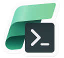

<table><tr>
<td></td>
<td><strong>Fabric automation tools for Azure DevOps</strong> 
<i>Automate workspace management and deployment tasks for Microsoft Fabric</i> 
<a href="https://marketplace.visualstudio.com/items?itemName=ms-fabric-api.fabric-automation-tools">Install now!</a>
</td>
</tr></table>

# Fabric automation tools for Azure DevOps
The Microsoft Fabric automation tools enable teams to build efficient and reusable release processes for their Fabric workspace and item management. You can leverage the tasks in this Azure DevOps extension to integrate Fabric operations into your organization's automation process. Here are a few examples of what can be done using this extension:
- Execute custom Fabric CLI commands across multiple platforms
- Automate Fabric item lifecycle management

## Build
You can use the [build.ps1](./build.ps1) script to build and package the extesnion.

If you are forking this Repo make sure to update the [dev.json](./config/dev.json).

`
 .\build.ps1
`

after building for the first time, you can use the following command to skip installing powrshell modules and reduce build time:

`
 .\build.ps1 -SkipModules
`

## Contributing	

This project welcomes contributions and suggestions.  Most contributions require you to agree to a	
Contributor License Agreement (CLA) declaring that you have the right to, and actually do, grant us	
the rights to use your contribution. For details, visit https://cla.opensource.microsoft.com.	

When you submit a pull request, a CLA bot will automatically determine whether you need to provide	
a CLA and decorate the PR appropriately (e.g., status check, comment). Simply follow the instructions	
provided by the bot. You will only need to do this once across all repos using our CLA.	

This project has adopted the [Microsoft Open Source Code of Conduct](https://opensource.microsoft.com/codeofconduct/).	
For more information see the [Code of Conduct FAQ](https://opensource.microsoft.com/codeofconduct/faq/) or	
contact [opencode@microsoft.com](mailto:opencode@microsoft.com) with any additional questions or comments.	

## Trademarks	

This project may contain trademarks or logos for projects, products, or services. Authorized use of Microsoft 	
trademarks or logos is subject to and must follow 	
[Microsoft's Trademark & Brand Guidelines](https://www.microsoft.com/en-us/legal/intellectualproperty/trademarks/usage/general).	
Use of Microsoft trademarks or logos in modified versions of this project must not cause confusion or imply Microsoft sponsorship.	
Any use of third-party trademarks or logos are subject to those third-party's policies.	
